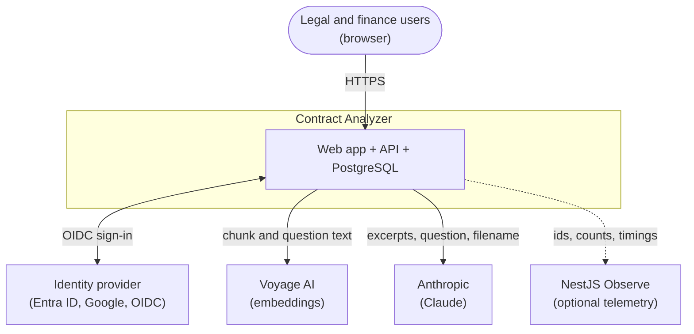
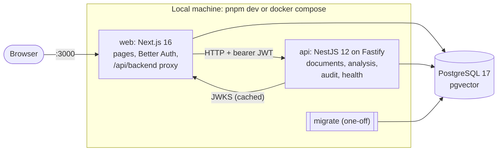
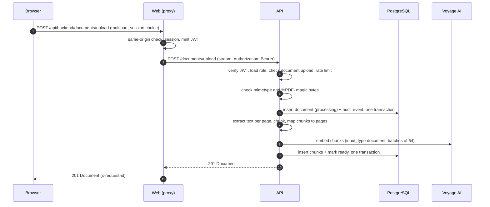
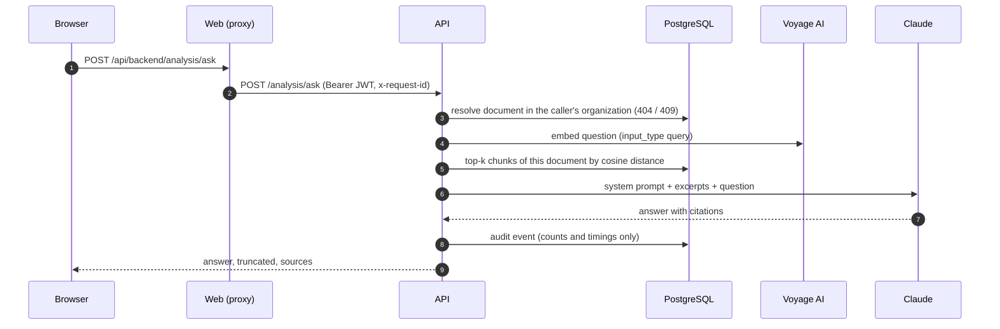

# Architecture

How the system is put together: its context, the containers that run it, the monorepo, the main
request flows, and exactly what data leaves for third parties. Read this before changing anything
that crosses a boundary.

## System context



## Containers



- **web** serves every page, owns sign-in and sessions (Better Auth), and is the only thing browsers
  talk to. Its `/api/backend/*` route handler forwards allowlisted calls to the API with a 5-minute
  JWT. Its `/api/auth/*` routes are Better Auth's.
- **api** does the work: PDF ingestion, retrieval, calls to Voyage and Claude, the audit log. It
  trusts nothing from the browser: every request carries a JWT it verifies against the web app's
  JWKS, and it reads the caller's role from the database.
- **PostgreSQL with pgvector** holds both apps' data in one schema owned by `@repo/db`, in a
  container locally and in CI.

This is a learning project: it runs locally and in CI only, and has no production deployment.

## Monorepo

```
apps/api            NestJS API (port 3001)
apps/web            Next.js app (port 3000)
packages/contracts  @repo/contracts: zod schemas, types, error codes, permissions, constants
packages/db         @repo/db: Drizzle schema (app + Better Auth tables), migrations, migrate script
docs/wiki/          this wiki
scripts/            repository settings and wiki tooling
```

pnpm workspaces and Turborepo run the tasks; both shared packages are compiled to ESM with type
declarations, because the Nest build can't compile TypeScript from another package. See
[Development workflow](Development-Workflow#root-scripts).

## Shared contracts

`@repo/contracts` is the single definition of the HTTP contract: request and response schemas,
`ERROR_CODES`, the role-permission matrix, audit actions and constants such as the "not found"
sentences. The API validates requests and serializes responses with these schemas (NestJS 12's
Standard Schema support), and the web app reuses them for forms, response validation and
permission-aware UI, so the two sides can't drift. See [API reference](API-Reference).

## Request flows

### Upload



A scanned PDF stops after extraction (422, document `failed`); a provider failure marks the
document `failed` and returns 502. Details on [RAG pipeline](RAG-Pipeline).

### Ask



### Compare

Like ask, with two documents: both are resolved first (any missing one is 404), the query is
embedded **once**, both documents are searched **in parallel**, each side gains the counterparts
of the other side's hits (see [RAG pipeline](RAG-Pipeline#comparison)), and Claude gets the
excerpts as `<contract_A>` and `<contract_B>`.

## The route handler proxy

The browser never calls the API. `apps/web/app/api/backend/[...path]/route.ts`:

1. rejects cross-site requests (`Sec-Fetch-Site`, or a foreign `Origin` on non-GET requests);
2. allows only the `documents`, `analysis` and `audit-events` prefixes;
3. requires a session with an active organization;
4. mints a 5-minute JWT and forwards the request with it, streaming the body, without cookies;
5. returns the API's status, body and safe headers, with the request id.

So the API needs no CORS for its own frontend, never sees a cookie, and can stay off the internet.
See [Frontend](Frontend#the-backend-proxy) and [Security](Security#trust-boundaries).

## Data boundaries

Exactly what leaves the application:

| Recipient                            | What is sent                                                                                                                                                                                                                                                                                      | What is not                                                                              |
| ------------------------------------ | ------------------------------------------------------------------------------------------------------------------------------------------------------------------------------------------------------------------------------------------------------------------------------------------------- | ---------------------------------------------------------------------------------------- |
| **Voyage AI**                        | The text of every chunk at upload; each question or comparison query.                                                                                                                                                                                                                             | Filenames, user or organization data.                                                    |
| **Anthropic**                        | The system prompt, the retrieved excerpts (up to `RAG_TOP_K` per document), the question or query, and the document filename(s).                                                                                                                                                                  | Other excerpts, user or organization data. Trace ids aren't propagated.                  |
| **NestJS Observe** (when configured) | Traces with route templates, status codes, durations, opaque user and organization ids, request ids; SQL statements without literals; custom spans and metrics (ids, counts, model names, timings); stack traces and nearby source lines of server errors, scrubbed of keys and query parameters. | Request or response bodies, document text, filenames, questions, answers, emails, names. |
| **Identity provider**                | The standard OIDC sign-in exchange.                                                                                                                                                                                                                                                               |                                                                                          |

Logs follow the same rule as telemetry: ids, counts, model names and durations only. The full
policy is on [Security](Security#data-handling).
