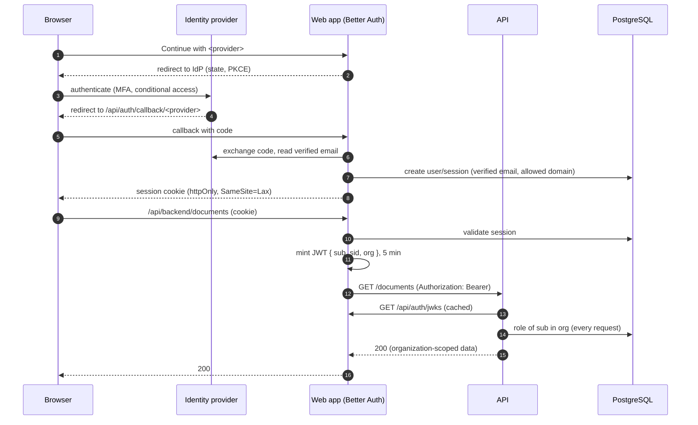

# Authentication and authorization

How users sign in (single sign-on only), how sessions and API tokens work, organizations, roles and
the full permission matrix, invitations, tenant isolation, the audit log, rate limits and the
cross-site protections. Read this before touching auth code (its own CODEOWNERS area, currently `@dmytronedilko`) or
configuring an identity provider.

## Overview

1. The browser signs in through Better Auth in the web app, using an identity provider, and gets an
   httpOnly session cookie. Sessions are stored in PostgreSQL.
2. For each API call, the web app's proxy checks the session and mints a **5-minute JWT** (EdDSA,
   signed with a key from the `jwks` table). It calls the API with `Authorization: Bearer <jwt>`;
   the session cookie never leaves the web app.
3. The API verifies the JWT against the web app's JWKS, loads the caller's role in the token's
   organization from the `member` table, checks the endpoint's permission and scopes every query to
   that organization.

## Identity providers

Sign-in is SSO only: no passwords, magic links or outgoing email. Each provider is enabled when all
of its variables are set ([Configuration](Configuration#web-app-appsweb)); production refuses to
start without one. The callback URL to register is `<APP_URL>/api/auth/callback/<id>`.

### Microsoft Entra ID

1. Entra admin center → App registrations → New registration. Supported account types: this
   organizational directory only (single tenant).
2. Redirect URI (Web): `https://contracts.example.com/api/auth/callback/microsoft`.
3. Certificates & secrets → new client secret.
4. Token configuration → add the optional claim **`verified_primary_email`** to the ID token (or make
   sure `email_verified` is sent). Without a verified email, users are refused with "didn't confirm
   your email address".
5. Set `AUTH_MICROSOFT_CLIENT_ID`, `AUTH_MICROSOFT_TENANT_ID` (your tenant id, not `common`, unless
   multi-tenant sign-in is intended) and the secret `AUTH_MICROSOFT_CLIENT_SECRET`.

Recommended Entra policies: require MFA for the app with a Conditional Access policy, block legacy
authentication, and optionally require compliant or hybrid-joined devices and restrict sign-in
locations. Assign the app to a group ("Assignment required") to control who may sign in.

### Google Workspace

1. Google Cloud console → APIs & Services → Credentials → OAuth client ID (Web application).
2. Authorized redirect URI: `https://contracts.example.com/api/auth/callback/google`.
3. OAuth consent screen: **Internal** (only your Workspace users).
4. Set `AUTH_GOOGLE_CLIENT_ID` and the secret `AUTH_GOOGLE_CLIENT_SECRET`; set
   `AUTH_ALLOWED_EMAIL_DOMAINS` to your Workspace domains.

Recommended Workspace policies: enforce 2-Step Verification (security keys or passkeys for admins),
use context-aware access to restrict the app, and review third-party app access in the Admin
console.

### Generic OIDC (Okta, Auth0, Keycloak…)

Create an OIDC web application with the redirect URI
`https://contracts.example.com/api/auth/callback/oidc` and scopes `openid email profile`, then set
`AUTH_OIDC_NAME` (the button label), `AUTH_OIDC_ISSUER` (discovery is read from
`<issuer>/.well-known/openid-configuration`), `AUTH_OIDC_CLIENT_ID` and `AUTH_OIDC_CLIENT_SECRET`.
PKCE is used. The provider must send `email` and `email_verified: true`. Enforce MFA in the provider.

### The mock provider (development and CI)

`docker compose` runs `navikt/mock-oauth2-server` as the generic OIDC provider on
`http://localhost:8080/default`. Its login form accepts any username and returns
`<username>@example.com` with a verified email. Never configure it outside development.

### Rules for every provider

- **Only verified emails** may sign up or sign in (checked when the user and each session are
  created).
- `AUTH_ALLOWED_EMAIL_DOMAINS`, when set, limits sign-up and sign-in to those domains.
- Accounts from different providers **link automatically only by a provider-verified email**; no
  provider is trusted to link unverified addresses.
- MFA and conditional access are the identity provider's job; configure them there.

## Sessions and cookies

- Sessions are rows in PostgreSQL, valid for `AUTH_SESSION_TTL_HOURS` (default 12) and refreshed at
  most hourly while in use. There is no cookie cache, so revoking a session takes effect on the next
  request.
- Cookies are httpOnly, `SameSite=Lax` and, in production, secure with the `__Secure-` prefix.
- "Sign out of all devices" (user menu) revokes every session of the user.
- A new session starts in the organization the user was last active in (or their most recent one);
  without any, the user goes to onboarding.
- Better Auth's own endpoints are rate-limited, with counters in PostgreSQL.

## API tokens

Minted by Better Auth's JWT plugin only on the server (the `set-auth-jwt` response header is
disabled, so tokens never reach the browser):

|              |                                                                                                                                                                                         |
| ------------ | --------------------------------------------------------------------------------------------------------------------------------------------------------------------------------------- |
| Algorithm    | EdDSA (Ed25519), key id in the header                                                                                                                                                   |
| Claims       | `sub` (user id), `sid` (session id), `org` (active organization id), `iss` = `APP_URL`, `aud` = `AUTH_AUDIENCE`, `iat`, `exp`                                                           |
| Lifetime     | 5 minutes                                                                                                                                                                               |
| Keys         | In the `jwks` table, private keys encrypted with `BETTER_AUTH_SECRET`; rotated every 90 days, old keys valid for 30 more days; published at `/api/auth/jwks`                            |
| Verification | The API (`jose`): EdDSA only, issuer and audience checked, `sub`, `sid` and `exp` required, 30 s clock tolerance; the JWKS is fetched lazily, cached and refetched on an unknown key id |

No email, name or other personal data is in a token. To retire the signing keys by hand, see
[Troubleshooting](Troubleshooting#signing-keys-and-better_auth_secret).

## Organizations and roles

All data belongs to an organization (a firm or team workspace). A user can belong to several and
switch the active one in the header. Every user can create organizations, unless
`AUTH_ORG_CREATOR_EMAILS` limits it to the listed emails; the creator becomes the owner. New
organizations are created on `/onboarding` or from **Create organization…** in the header's
switcher, and become the active one. The last owner can't leave, be removed or be demoted; the
settings page disables **Leave organization** for them and says why.

The permission matrix lives in `ROLE_PERMISSIONS`
([`packages/contracts/src/permissions.ts`]({{repo}}/blob/main/packages/contracts/src/permissions.ts))
and is the single source for the API guards, Better Auth's access control and the UI:

| Permission            | owner | admin | member | viewer |
| --------------------- | :---: | :---: | :----: | :----: |
| `document:read`       |   ✓   |   ✓   |   ✓    |   ✓    |
| `analysis:run`        |   ✓   |   ✓   |   ✓    |   ✓    |
| `document:upload`     |   ✓   |   ✓   |   ✓    |        |
| `document:delete:own` |   ✓   |   ✓   |   ✓    |        |
| `document:delete:any` |   ✓   |   ✓   |        |        |
| `audit:read`          |   ✓   |   ✓   |        |        |
| `member:manage`       |   ✓   |   ✓   |        |        |
| `organization:delete` |   ✓   |       |        |        |

- `document:delete:own` allows deleting documents you uploaded; `document:delete:any`, anyone's.
- `member:manage` covers inviting, changing roles and removing members (Better Auth's own member and
  invitation statements are granted alongside). Admins can't assign, change or remove owners.
- The API reads the role **on every request**, so a removed member or a lowered role takes effect on
  the next request, not when the token expires.
- Each API route declares its permission; a route without one is denied (fail closed).
- Hiding actions in the UI is a convenience only; the API enforces.

## Invitations

There is no email: an owner or admin creates an invitation for an email address and role in
Settings → Organization and copies its link (`<APP_URL>/invite/<id>`) to send it themselves.

- Links expire after 7 days and can be revoked.
- Accepting requires being signed in **with the invited email address**; anyone else sees
  "invitation unavailable".
- Pending invitations also show on the invitee's onboarding page.

## Tenant isolation

- Every application row (`documents`, `document_chunks` through their document, `audit_events`) has an
  organization, and every repository method takes `organizationId` as a required argument; no
  document query is ever unscoped.
- A document id from another organization is answered with **404 `DOCUMENT_NOT_FOUND`**, never 403,
  so its existence isn't revealed. Lists never include it.
- Vector search runs only after the document has been resolved within the organization.
- The model only ever sees excerpts of the caller's organization's documents.
- Integration tests check get, delete, ask, compare and lists against another organization's
  documents.

## Audit log

`audit_events` records who did what, in which organization and request. Owners and admins read it in
Settings → Audit log or through `GET /audit-events`.

| Action                | Recorded by | When                                             | Metadata                                                                     |
| --------------------- | ----------- | ------------------------------------------------ | ---------------------------------------------------------------------------- |
| `auth.sign_in`        | web         | A session is created with an active organization |                                                                              |
| `auth.sign_out`       | web         | Sign-out, or sign-out of all devices             | `allDevices`                                                                 |
| `organization.create` | web         | An organization is created                       |                                                                              |
| `invitation.create`   | web         | An invitation is created                         | `role`                                                                       |
| `invitation.accept`   | web         | An invitation is accepted                        |                                                                              |
| `member.remove`       | web         | A member is removed or leaves                    | `self`                                                                       |
| `member.role_change`  | web         | A member's role changes                          | `role`                                                                       |
| `document.upload`     | API         | Same transaction as the new document             | `sizeBytes`                                                                  |
| `document.delete`     | API         | Same transaction as the delete                   | `ownDocument`                                                                |
| `analysis.ask`        | API         | After a successful answer                        | `sourceCount`, `truncated`, `durationMs`                                     |
| `analysis.compare`    | API         | After a successful comparison                    | `otherDocumentId`, `sourceCountA`, `sourceCountB`, `truncated`, `durationMs` |

Metadata holds ids, counts, flags and durations only, never questions, answers, filenames, emails or
names. Sign-in and sign-out are only recorded when the session has an active organization, since
every event belongs to one. There is no retention job yet.

## Rate limits

Per user, after authentication: ask and compare share `RATE_LIMIT_ANALYSIS_PER_MINUTE` (default 30
per minute); uploads `RATE_LIMIT_UPLOADS_PER_HOUR` (default 20 per hour). Exceeding one is 429
`RATE_LIMITED` with `Retry-After`. Counters are in memory, correct for the single API instance;
several instances would need shared storage. Better Auth's endpoints have their own limits.

## CSRF and origin protections

- Session cookies are `SameSite=Lax`, and Better Auth rejects state-changing auth requests from
  untrusted origins (only `APP_URL` is trusted).
- The backend proxy rejects requests whose `Sec-Fetch-Site` is anything other than `same-origin` or
  `none`, and non-GET requests without that header whose `Origin` isn't `APP_URL`, with 403
  `ORIGIN_NOT_ALLOWED`. Other sites can't make a visitor's browser upload files or spend AI calls.
- The API never accepts cookies, only bearer tokens, and rejects browser requests from origins not
  in `CORS_ORIGINS` (CORS is off by default). See [Security](Security#the-origin-policy).

## Future work

Not built yet: per-organization SAML/OIDC SSO configured by organization admins, SCIM provisioning,
API keys or OAuth clients for machine access, separate PostgreSQL roles for the API and the web app,
and an audit-log retention job.
