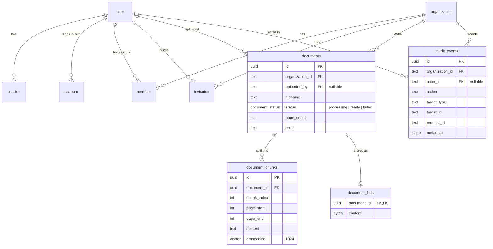

# Database

The PostgreSQL schema shared by the API and the web app, how data is scoped to organizations, the
audit table, pgvector and why searches are exact, the migration workflow and what a managed
database must provide. Read this before writing a query or a migration.

## The `@repo/db` package

[`packages/db`]({{repo}}/tree/main/packages/db) owns the entire database, so one database has one
migration history:

- `src/auth-schema.ts`: Better Auth's tables, **generated** with the Better Auth CLI (don't edit by
  hand; see [Better Auth tables](#better-auth-tables)).
- `src/schema.ts`: the application tables.
- `drizzle/`: SQL migrations and drizzle-kit snapshots.
- `src/migrate.ts`: applies migrations; production runs it from the API image.

Both apps connect with node-postgres (`pg`): the API through `@nestjs/drizzle`, the web app through
one pool shared by Better Auth's Drizzle adapter and its audit writes.

## Entity relationships



Better Auth also owns `verification` (OAuth state), `jwks` (token signing keys, private keys
encrypted) and `rate_limit` (its own rate-limit counters). Better Auth ids are text; application ids
are UUIDs.

## Tables and indexes

| Table             | Notes                                                                                                                                                   | Indexes                                                        |
| ----------------- | ------------------------------------------------------------------------------------------------------------------------------------------------------- | -------------------------------------------------------------- |
| `documents`       | `organization_id` NOT NULL, cascades when the organization is deleted; `uploaded_by` becomes NULL when the user is deleted.                             | `(organization_id, created_at DESC)` for the newest-first list |
| `document_chunks` | `embedding vector(1024) NOT NULL`; cascades with the document.                                                                                          | B-tree on `document_id`; unique `(document_id, chunk_index)`   |
| `document_files`  | The uploaded PDF (`bytea`), one row per document, written with it; cascades with the document. Separate so lists and searches never read file contents. | Primary key `document_id`                                      |
| `audit_events`    | `organization_id` cascades; `actor_id` becomes NULL when the user is deleted.                                                                           | `(organization_id, created_at DESC)`                           |
| `member`          | The source of roles; the API reads it on every request.                                                                                                 | `organization_id`, `user_id`                                   |
| `session`         | Holds `active_organization_id`.                                                                                                                         | `user_id`                                                      |

## Organization scoping

Every application row belongs to an organization, and the API's repositories take the
`organizationId` as a required argument on every method, so no document query is ever unscoped. An
id from another organization behaves exactly like a missing one (404). Vector search filters by
document id only, after the document has been resolved within the organization. See
[Authentication and authorization](Authentication-and-Authorization#tenant-isolation).

## The audit table

`audit_events` records who did what in which organization and request: uploads and deletes (in the
same transaction as the change), questions and comparisons (after success), and sign-ins,
invitations and membership changes (written by the web app). `metadata` only holds ids, counts,
flags and durations, never questions, answers, filenames or personal data. `action` is text (one of
`AUDIT_ACTIONS`) so adding an action needs no migration. There is no retention job yet.

## pgvector and exact search

Migration `0000_enable_pgvector.sql` runs `CREATE EXTENSION IF NOT EXISTS vector` before the
tables. Searches use cosine distance (`<=>`) over one document's chunks through the `document_id`
index and always return k rows. There is deliberately **no HNSW index**: combined with the
per-document filter, an approximate index can return fewer than k rows. See
[RAG pipeline](RAG-Pipeline#retrieval-exact-per-document).

## Migrations

Migrations are SQL files generated by drizzle-kit from the schema:

```sh
pnpm db:generate     # after changing packages/db/src/*.ts: writes drizzle/NNNN_*.sql and a snapshot
pnpm db:migrate      # applies pending migrations to DATABASE_URL (packages/db/.env)
```

For SQL drizzle-kit can't express (extensions, data backfills), create an empty migration and write
it by hand:

```sh
pnpm --filter @repo/db exec drizzle-kit generate --custom --name backfill_something
```

Rules:

- **Forward-only.** There are no down migrations; fix forward.
- **Expand/contract.** Write migrations as a rolling deploy would need them, where the previous API
  keeps serving while `migrate` runs: every migration must work with the previous release: add nullable columns or columns with defaults,
  add tables and indexes, backfill in a separate migration; drop or rename only in a later release
  once no running code uses the old shape.
- **Review generated SQL** in the pull request; the snapshots are marked generated and collapsed.
- Large tables: create indexes `CONCURRENTLY` in a custom migration.

## Better Auth tables

`src/auth-schema.ts` is generated from a schema-only Better Auth configuration
([`scripts/auth-schema.config.ts`]({{repo}}/blob/main/packages/db/scripts/auth-schema.config.ts))
that mirrors the schema-affecting features of the web app (organization and JWT plugins, database
rate limiting). When those plugins change in `apps/web/lib/auth.ts`, update the config, then:

```sh
pnpm --filter @repo/db auth:generate
pnpm format
pnpm db:generate
```

Commit the regenerated schema and migration separately from hand-written changes.

## Resetting locally

```sh
docker compose down --volumes   # deletes the local database volume
pnpm services:up
pnpm db:migrate
```

## Managed PostgreSQL requirements

- PostgreSQL 17 (the version CI tests against) with the **pgvector extension >= 0.8** available, and a migration user
  allowed to run `CREATE EXTENSION vector` (or have it created beforehand).
- TLS: add `?sslmode=require` (or the provider's recommended mode) to `DATABASE_URL`.
- Backups, point-in-time recovery and high availability are the provider's job; test restores.
- Size connections for both apps: the web app's pool holds up to 10 connections and the API's
  node-postgres pool up to 10 by default.
