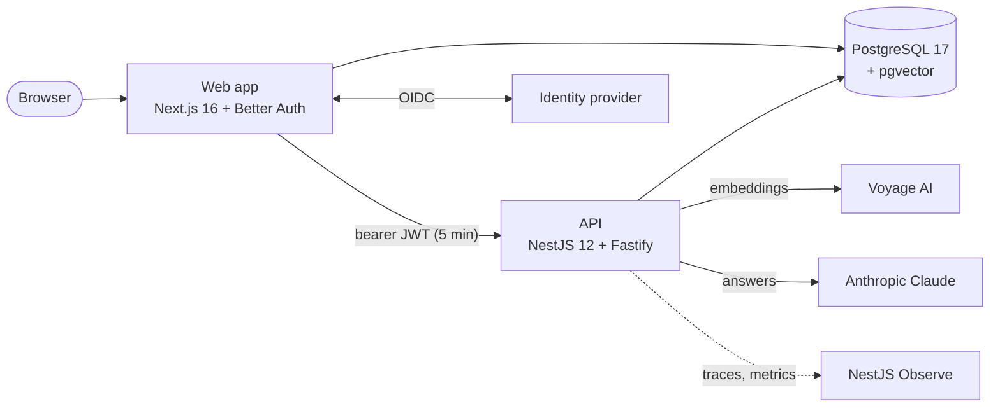

# Contract Analyzer

Contract Analyzer answers questions about multi-page legal and financial PDF contracts and compares
two contracts, citing the page behind every statement. It is a learning project that runs locally
and in CI, with no production deployment. This wiki is the documentation for everyone who builds,
runs or secures it.

> **Not legal advice.** Answers are AI-generated from excerpts retrieved from the uploaded
> documents. They can miss clauses that weren't retrieved and can be wrong. Always verify against
> the original document.

## What it does

- **Upload** a PDF contract. Its text is extracted page by page, split into overlapping chunks and
  embedded with Voyage AI's legal model (`voyage-law-2`).
- **Ask** a question about one document. The most relevant excerpts are retrieved and Claude
  answers only from them, citing excerpts and pages, e.g. `[chunk 2, pp. 4–5]`.
- **Compare** two documents on a topic (termination, liability, fees...). Claude produces a summary,
  a differences table and what was only found in one contract, citing both sides.
- **Work as a team.** Users sign in with single sign-on (Microsoft Entra ID, Google or any OIDC
  provider) and belong to organizations with owner, admin, member and viewer roles. Every action
  is scoped to the active organization and important ones are written to an audit log.

It is built for attorneys and finance professionals who need to find and check contract terms
quickly, not to replace reading the contract.

## Architecture at a glance

The browser only talks to the web app. The web app signs users in, keeps their sessions and calls
the API server-to-server with a short-lived token. Details are on [Architecture](Architecture).

## Sections

**Getting started**: [Getting started](Getting-Started), [Configuration](Configuration),
[Troubleshooting](Troubleshooting).

**Architecture**: [Architecture](Architecture), [RAG pipeline](RAG-Pipeline),
[Prompt design](Prompt-Design), [API reference](API-Reference), [Frontend](Frontend),
[Database](Database), [Architecture decisions](Architecture-Decisions).

**Operations**: [CI/CD](CI-CD), [Observability](Observability).

**Engineering**: [Development workflow](Development-Workflow), [Code quality](Code-Quality),
[Testing](Testing), [Dependencies](Dependencies).

**Security**: [Authentication and authorization](Authentication-and-Authorization),
[Security](Security), [Repository settings](Repository-Settings).

## About this wiki

The pages live in [`docs/wiki/`]({{repo}}/tree/main/docs/wiki) and are published here by the
[wiki workflow]({{repo}}/blob/main/.github/workflows/wiki.yml) on every change to `main`. Edit
them through pull requests: direct edits on the wiki are overwritten by the next publish.
