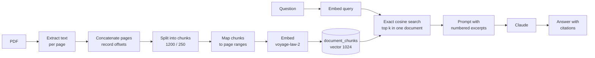

# RAG pipeline

How a PDF becomes searchable excerpts and how questions are answered from them: extraction, page
mapping, chunking, embeddings, retrieval, comparison and the known limitations. Read this before
tuning retrieval or debugging an unexpected answer.

## Overview

The code is in [`apps/api/src/documents`]({{repo}}/tree/main/apps/api/src/documents),
[`vector-store`]({{repo}}/tree/main/apps/api/src/vector-store) and
[`analysis`]({{repo}}/tree/main/apps/api/src/analysis).

## Extraction and page mapping

- `pdf-parse` v2 (pdf.js) extracts the text **of each page separately**, with eval disabled since
  uploads are untrusted. Keeping pages apart is what makes page citations possible.
- Text is normalized without changing words: line endings unified, runs of spaces collapsed, at
  most one blank line kept (paragraph breaks guide the splitter).
- If no page contains a letter or digit, the PDF has no text layer (a scan): the document becomes
  `failed` and the upload returns 422 `PDF_NO_TEXT_LAYER`. A file that starts with `%PDF-` but
  can't be parsed is 415 `UNSUPPORTED_FILE_TYPE`.
- Non-empty pages are concatenated with a blank line between them, and each page's character range
  in the result is recorded.

## Chunking

`RecursiveCharacterTextSplitter` (from `@langchain/textsplitters`) splits the concatenated text:

| Parameter      | Value                              | Why                                                                           |
| -------------- | ---------------------------------- | ----------------------------------------------------------------------------- |
| `chunkSize`    | 1200 characters (about 300 tokens) | Small enough to retrieve one clause, large enough to keep most clauses whole. |
| `chunkOverlap` | 250 characters                     | A clause cut at a boundary is complete in one of the neighbors.               |

The splitter returns strings, so each chunk is located in the concatenated text (searching forward
from the previous chunk) and its first and last characters are mapped back to pages. That gives
`page_start` and `page_end`, so a chunk spanning a page break cites `pp. 4–5`.

## Embeddings

- Model: Voyage AI **`voyage-law-2`** (trained on legal text), 1024 dimensions, the size of
  `document_chunks.embedding`. A different model must also produce 1024 dimensions.
- `input_type` is `document` when indexing and `query` when searching (asymmetric retrieval).
- Chunks are embedded in batches of 64 (Voyage accepts 128).
- Each request has a 30-second timeout. 429, 5xx, timeouts and network errors are retried up to 4
  attempts with exponential backoff (0.5 s doubling, capped at 8 s) and jitter, honoring
  `Retry-After`. Other errors fail immediately. Retries are counted in `embeddings.retries`.
- All chunks are inserted and the document marked `ready` in one transaction, so a document is never
  `ready` with only some of its chunks.

## Retrieval: exact, per document

For each question, the question is embedded and the `RAG_TOP_K` (default 5) chunks of **that one
document** closest by cosine distance are returned, most similar first, with
`similarity = 1 − distance`.

The search is deliberately **exact**: Postgres reads the document's chunks through the
`document_id` B-tree index and computes every distance. A contract has at most a few thousand
chunks, so this is fast, and it **always returns k rows**. An HNSW index was rejected: combined with
the `WHERE document_id = …` filter, its approximate scan can return fewer than k rows and silently
weaken answers. If search across documents is ever added, use HNSW with `vector_cosine_ops` and
`hnsw.iterative_scan`. See [Architecture decisions](Architecture-Decisions#exact-search-instead-of-hnsw).

The excerpts are numbered 1..k in retrieval order; that number is the `ref` citations use.

## Answering

The excerpts, with their page ranges, go into the prompt before the question; Claude
(`ANTHROPIC_MODEL`, default `claude-sonnet-5-5`) answers only from them and cites `[chunk N, p. X]`.
`max_tokens` is 16000; if the answer hits it, the response says `truncated: true`. Requests time
out after 120 seconds and the SDK retries 429/5xx twice. For models that support it, a request
declined by Anthropic's safety classifiers is retried on a fallback model automatically
(server-side fallbacks); a request still declined is reported as `AI_PROVIDER_UNAVAILABLE`. The
prompts and their rules are on [Prompt design](Prompt-Design).

## Comparison

Both documents are resolved within the organization first, the query is embedded **once**, and the
two per-document searches run **in parallel**.

Searched separately, one contract can miss a clause that the other's hits contain: when the second
contract words it differently, it ranks below its top k for the query. So each hit also brings its
**counterpart**, the most similar chunk of the other contract, found by comparing the stored chunk
embeddings (`VectorStoreService.searchCounterparts`, no embedding calls). Each side then holds its
own hits first and the new counterparts after them, up to 2k excerpts, and keeps its own numbering,
cited as `[A: chunk N, p. X]` and `[B: chunk N, p. X]`. A counterpart's `similarity` is still its
similarity to the query. The API log records how many counterparts each side gained.

## Limitations

- **Scanned PDFs aren't supported.** There's no OCR: a PDF without a text layer is rejected.
- **Retrieval can miss clauses.** Only k excerpts per document reach the model (up to 2k per
  contract in a comparison, with counterparts). A question whose
  answer is spread across many clauses, or phrased very differently from the contract, may get a
  partial answer.
- **"Not found" means "not in the retrieved excerpts"**, never "not in the contract". The prompts
  say so, and the UI shows that sentence as a neutral notice rather than an answer.
- **Tables and layout** are flattened to text; multi-column layouts can interleave.
- **One document per question**; comparison covers exactly two.

## Tuning

| Knob                   | Where                                | Trade-off                                                                                                                                                        |
| ---------------------- | ------------------------------------ | ---------------------------------------------------------------------------------------------------------------------------------------------------------------- |
| `RAG_TOP_K` (1–20)     | API env                              | More excerpts raise recall and answer completeness but cost more tokens and latency, and can dilute the answer with irrelevant text.                             |
| Chunk size and overlap | `apps/api/src/documents/chunking.ts` | Larger chunks keep long clauses whole but retrieve less precisely; more overlap helps boundaries but stores more. Changing them requires re-uploading documents. |
| `ANTHROPIC_MODEL`      | API env                              | Larger models follow the citation rules more reliably at higher cost and latency.                                                                                |
| `VOYAGE_MODEL`         | API env                              | Must stay 1024-dimensional; changing it requires re-embedding every document.                                                                                    |

Watch the `rag.top_similarity` summary and the `rag.not_found_answers` counter on
[Observability](Observability) before and after any change.
