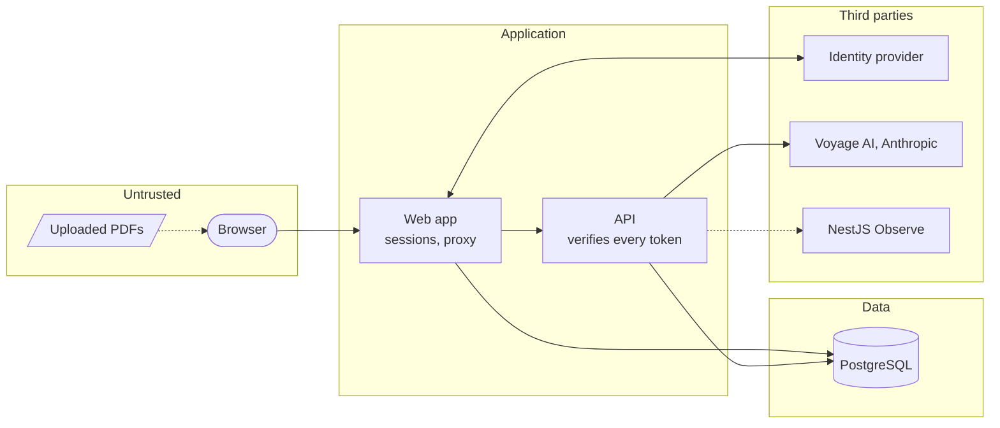

# Security

The threat model in brief, how data is handled, the trust boundaries, why CORS isn't access control,
the controls in place, and how to report a vulnerability. Read this before a security review or a
change that touches data, auth or the network edge.

## Threat model summary

| Asset or risk                                                          | Main threats                                                                   | Key controls                                                                                                         |
| ---------------------------------------------------------------------- | ------------------------------------------------------------------------------ | -------------------------------------------------------------------------------------------------------------------- |
| **Confidential contracts** (files, extracted text, questions, answers) | Disclosure to other tenants, to logs or telemetry, to unintended third parties | Organization scoping everywhere, nothing confidential logged or traced, only Voyage AI and Anthropic receive content |
| **Tenant isolation**                                                   | A user reaching or detecting another organization's documents                  | Required `organizationId` on every query, 404 for foreign ids, roles read per request, integration tests             |
| **Identity**                                                           | Account takeover, unverified emails, stale access after offboarding            | SSO only with the IdP's MFA, verified emails only, optional domain allowlist, immediate revocation                   |
| **The API**                                                            | Forged or replayed tokens, abuse, cross-site requests                          | 5-minute EdDSA tokens verified against JWKS, per-user rate limits, origin guard, internal-only by default            |
| **Prompt injection** in uploaded documents                             | A contract instructing the model, or impersonating the other contract          | Data framing and tag escaping in prompts, no tools, scope limited to the caller's documents, no raw HTML rendering   |
| **Secrets** (provider keys, `BETTER_AUTH_SECRET`)                      | Leaks through code, logs, CI                                                   | Git-ignored `.env` files, redaction, secret scanning with push protection or gitleaks                                |
| **Supply chain**                                                       | Hijacked packages or actions, vulnerable images                                | 7-day release age, trust policy, Dependabot cooldown, SHA-pinned actions, digest-pinned images, Trivy, CodeQL        |

## Trust boundaries

- The **browser** is untrusted: it only holds an httpOnly session cookie and talks to the web app.
- **Uploaded documents** are untrusted input, to the PDF parser (eval disabled, parsing errors
  contained) and to the model (prompt injection defenses).
- The **web app** authenticates users and is the only issuer of API tokens.
- The **API** trusts no caller: it verifies every token and reads roles from the database.
- **Third parties** receive only what [Architecture](Architecture#data-boundaries) lists.

## Data handling

- **Stored**: PDFs are not kept; their extracted text is stored as excerpts with embeddings, with
  the filename, page count and status, all scoped to the organization. Deleting a document deletes
  its excerpts; deleting an organization deletes all its data.
- **Sent to providers**: excerpt text and questions to Voyage AI (embeddings); excerpts, questions and
  filenames to Anthropic (answers). Review the providers' data retention terms for your
  organization.
- **Never logged, traced or audited**: document text, filenames, questions, answers, emails, names,
  tokens or keys. Logs and telemetry carry ids, counts, model names and durations; server error
  messages are not logged because database errors can quote stored text; redaction masks provider
  keys and query parameters before anything reaches Observe.
- **Audit metadata**: ids, counts, flags and durations only.
- **Transport**: HTTPS with HSTS at the edge; the database connection should use TLS.

## The origin policy

CORS is **not** access control. It only decides whether a page on another origin may _read_ a
response; the browser still _sends_ the request, and a cross-site form `POST` (including a multipart
upload) needs no preflight at all. So:

- The web app's proxy rejects cross-site requests outright (`Sec-Fetch-Site`, or a foreign `Origin`
  on non-GET requests) with 403 `ORIGIN_NOT_ALLOWED`, and never sends CORS headers.
- The API rejects every request whose `Origin` isn't in `CORS_ORIGINS`, preflight or not, before any
  handler runs; with CORS off (the default) that is every browser request.
- Session cookies are `SameSite=Lax`, the API accepts bearer tokens only, and Better Auth trusts only
  `APP_URL`.

Details: [API reference](API-Reference#cors-and-origins) and
[Authentication and authorization](Authentication-and-Authorization#csrf-and-origin-protections).

## Controls in place

- **Authentication**: SSO only (Entra ID, Google, OIDC), verified emails, optional domain allowlist,
  database sessions without cookie cache, "sign out of all devices".
- **Authorization**: a single permission matrix, enforced by the API on every route (fail closed),
  roles read per request, organization-scoped queries, 404 for foreign ids.
- **API edge**: internal by default, origin guard, optional exact CORS, per-user rate limits, request
  size limits, validated inputs and serialized outputs (zod), generic error messages.
- **Web**: same-origin proxy with a path allowlist, no raw HTML in answers, secure cookies. There
  are no edge security headers (HSTS, frame denial, CSP): they belong to a TLS proxy, and this
  project has no production deployment (see
  [Architecture decisions](Architecture-Decisions#no-production-deployment)).
- **Audit log** for sign-ins, membership changes, uploads, deletes and analyses.
- **Supply chain**: see [Dependencies](Dependencies); images run as non-root, without npm or
  corepack, with Debian security updates applied, and are scanned with Trivy.
- **Repository**: rulesets with reviews, code owners and up-to-date branches, CodeQL, secret scanning and
  push protection (or gitleaks), Dependabot, OpenSSF Scorecard on public repositories (see
  [Repository settings](Repository-Settings)).

## Reporting a vulnerability

Report privately through GitHub's private vulnerability reporting, never in a public issue. The
policy, scope and response times are in [`SECURITY.md`]({{repo}}/blob/main/SECURITY.md).
